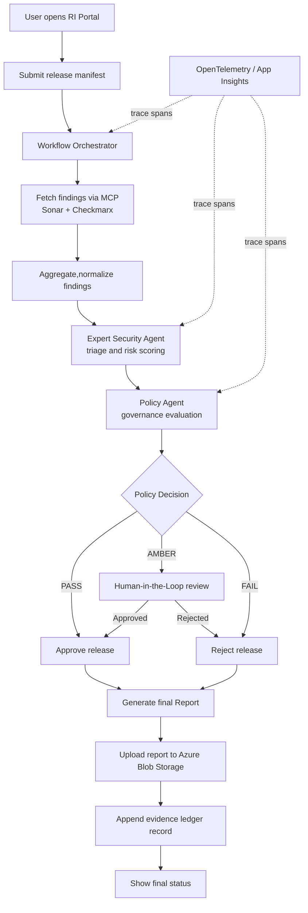

## Release Intelligence (RI) System
<p align="center">


</p>

## Overview
The Release Intelligence (RI) system is an **AI-powered security review and attestation platform** that automates the analysis of security vulnerabilities across microservices. It combines expert security agents, policy governance, and human-in-the-loop (HITL) workflows to generate comprehensive release attestation reports.

**Key Capabilities:**
- 🔍 **Security Triage**: Expert AI agent analyzes SAST/SCA findings with toxic combination detection
- 📋 **Policy Governance**: Sovereign policy agent enforces ISO-27001-Agentic-Baseline rules
- 🤝 **HITL Workflow**: Pauses for Security Lead approval when policy violations detected
- 📄 **PDF Attestation**: Generates styled reports with KPIs, charts, and policy decisions
- 🧠 **Cloud Agent Runtime**: Expert and Policy agents run via Azure AI Foundry endpoints with traceable execution

## Architecture At A Glance



## Tech Stack and Tools

### Core Platform
- **Language**: Python 3.11
- **UI**: Streamlit (`streamlit>=1.36.0`)
- **Report Generation**: FPDF2 (`fpdf2>=2.7.9`)
- **HTTP Integration**: Requests (`requests>=2.32.3`)

### AI and Cloud Integration
- **LLM SDK**: OpenAI Python SDK (`openai>=1.51.0`)
- **Agent Runtime**: Azure AI Foundry Agent Service via `azure-ai-projects`
- **Identity and Auth**: Azure Identity (`azure-identity>=1.17.1`), Entra ID credentials
- **Artifact Storage**: Azure Blob Storage (`azure-storage-blob>=12.23.1`)

### Security Data Sources
- **SAST/SCA Providers**: Checkmarx
- **Code Quality and Security Signals**: SonarQube
- **MCP Adapter Layer**: `src/mcp/mcp_client.py` with mock-mode and live-mode wiring

### Observability and Governance
- **Tracing API/SDK**: OpenTelemetry (`opentelemetry-api==1.35.0`, `opentelemetry-sdk==1.35.0`)
- **Azure Monitoring Exporter**: `azure-monitor-opentelemetry-exporter>=1.0.0b35`
- **Governance Rules**: JSON policy packs in `governance/policy.json`
- **Audit Evidence**: Hash-chained ledger in `session/evidence_ledger.jsonl`

### Dev and Delivery Tooling
- **Testing**: Pytest (`pytest>=9.0.0`)
- **Containerization**: Docker multi-stage build (`Dockerfile`)
- **Local Orchestration**: Docker Compose (`docker-compose.yml`)

### Stack-to-Pipeline Map
- **Ingest**: SonarQube + Checkmarx reports via MCP client (`src/mcp/mcp_client.py`)
- **Analyze**: Expert Security Agent on Azure AI Foundry (`src/agents/expert_security_agent.py`)
- **Decide**: Policy Agent + governance rules (`src/agents/policy_agent.py`, `governance/policy.json`)
- **Approve**: HITL reviewer flow in Streamlit UI (`ui/app.py`)
- **Attest**: PDF generation with FPDF2 (`src/workflow/ri_workflow.py`)
- **Store**: Final artifacts in Azure Blob + tamper-evident local evidence ledger (`session/evidence_ledger.jsonl`)
- **Observe**: OpenTelemetry traces exported to Azure Monitor/Application Insights

## Azure Prerequisites (Create First)

Create these resources in this order before running the live cloud path:

1. **Resource Group**
- Example: `rg-release-intelligence-dev`
- Purpose: parent container for all project resources.

2. **Azure AI Foundry Project (Azure AI services hub/project)**
- Purpose: hosts your Expert and Policy agents and model deployment bindings.
- Required env: `AZURE_AI_PROJECT_ENDPOINT`, `FOUNDRY_EXPERT_AGENT_NAME`, `FOUNDRY_POLICY_AGENT_NAME`, `AZURE_OPENAI_DEPLOYMENT`.

3. **Model Deployment in the Foundry project**
- Example model: `gpt-4o-mini` (or your approved equivalent).
- Purpose: backing model used by Foundry agents.
- Required env: `AZURE_OPENAI_DEPLOYMENT` should match the deployment name.

4. **Microsoft Entra App Registration (Service Principal)**
- Purpose: non-interactive auth for Docker/CI/headless runs.
- Required env: `AZURE_TENANT_ID`, `AZURE_CLIENT_ID`, `AZURE_CLIENT_SECRET`.
- Minimum access: grant the app access to the Foundry project and related resources needed for runtime calls.

5. **Application Insights (Azure Monitor)**
- Purpose: distributed tracing and hackathon demo observability.
- Required env: `APPLICATIONINSIGHTS_CONNECTION_STRING`.

6. **Storage Account + Blob Container**
- Purpose: store final attestation PDFs for `GO`/`REJECTED` outcomes.
- Required env: `AZURE_STORAGE_CONNECTION_STRING`, `AZURE_STORAGE_CONTAINER`, optional `AZURE_STORAGE_BLOB_PREFIX`.

7. **Optional: Key Vault (recommended for production)**
- Purpose: securely store secrets instead of raw `.env` values.
- Typical secrets: client secret, storage connection string, API keys.

If you only want a local demo with mock data, Azure resources are optional. The app can run without Foundry/Blob/Insights and will fall back to mock MCP behavior.

## Directory Structure
```
release-intelligence-ri/
├── ui/
│   └── app.py                          # Streamlit UI for workflow management
├── src/
│   ├── main.py                         # CLI entry point
│   ├── agents/
│   │   ├── expert_security_agent.py    # Risk triage with toxic combo detection
│   │   ├── policy_agent.py             # Governance decision engine
│   ├── workflow/
│   │   └── ri_workflow.py              # Core orchestration + PDF generation
│   ├── mcp/
│   │   ├── mcp_client.py               # MCP protocol client
│   │   └── mock_mcp_servers.py         # Mock SonarQube/Checkmarx data
├── governance/
│   ├── policy.json                     # 2026.1 policy rules (active)
├── tests/
│   └── test_workflow.py
├── reports/                            # Generated PDF attestations
├── session/                            # Runtime session data
├── requirements.txt
└── README.md
```

## Setup Instructions

### 1. Clone the Repository
```bash
git clone <repository-url>
cd release-intelligence-ri
```

### 2. Create Virtual Environment
```bash
python3 -m venv .venv
source .venv/bin/activate  # macOS/Linux
# .venv\Scripts\activate   # Windows
```

### 3. Install Dependencies
```bash
pip install -r requirements.txt
```

### 4. Configure for Live Demo with Real Tools
To use actual tools instead of mock data, set the following environment variables:

#### Azure AI Foundry (for AI Analysis)
```bash
export AZURE_AI_PROJECT_ENDPOINT="https://<resource>.services.ai.azure.com/api/projects/<project-name>"
export AZURE_TENANT_ID="<entra-tenant-id>"
export AZURE_CLIENT_ID="<app-registration-client-id>"
export AZURE_CLIENT_SECRET="<app-registration-client-secret>"
export FOUNDRY_POLICY_AGENT_NAME="policy-governance-agent"
export FOUNDRY_POLICY_AGENT_VERSION=""
export FOUNDRY_EXPERT_AGENT_NAME="expert-security-agent"
export FOUNDRY_EXPERT_AGENT_VERSION=""
export AZURE_OPENAI_DEPLOYMENT="gpt-4o-mini"
export APPLICATIONINSIGHTS_CONNECTION_STRING="InstrumentationKey=...;IngestionEndpoint=https://..."
```

The expert security agent and policy agent both use the Foundry Agent Service lifecycle through `azure-ai-projects`: each opens a conversation, invokes the configured agent by reference, reads the response, and deletes the conversation. This path authenticates with Entra ID. For Docker or other headless runs, set `AZURE_TENANT_ID`, `AZURE_CLIENT_ID`, and `AZURE_CLIENT_SECRET` for a service principal that has access to the Foundry project. For local non-container runs, `az login` or managed identity also works.

#### SonarQube and Checkmarx (for Security Scanning)
```bash
export SONAR_URL="https://your-sonarqube-instance.com"
export CHECKMARX_URL="https://your-checkmarx-instance.com"
export MCP_API_KEY="your-api-key-for-tools"
```

#### Azure Blob Storage (for final approved PDFs)
Approved final attestation PDFs can be uploaded automatically to Blob Storage.

```bash
export AZURE_STORAGE_CONNECTION_STRING="DefaultEndpointsProtocol=..."
export AZURE_STORAGE_CONTAINER="attestation-reports"
export AZURE_STORAGE_BLOB_PREFIX="attestations"
```

#### Optional Reviewer Identity Context (for verified HITL approvals)
When set, manual approvals in the UI are stamped as verified reviewer actions.

```bash
export REVIEWER_DISPLAY_NAME="Security Lead User"
export REVIEWER_PRINCIPAL_ID="aad-object-id-or-upn"
export REVIEWER_ROLE="Security_Lead"
```

#### Optional Strict Enterprise Approval Mode
When enabled, manual approval/rejection is allowed only for verified reviewer identities.

```bash
export STRICT_ENTERPRISE_APPROVAL="true"
```

*Note: If these are not set, the system defaults to mock data for development.*

#### Deploy to Azure AI Foundry (Microsoft Foundry)
1. Create an Azure AI Foundry project.
2. Use the Azure AI SDK to deploy the workflow as an AI app.
3. Set the above environment variables in your Azure AI Foundry environment.

For detailed deployment steps, refer to [Azure AI Foundry documentation](https://learn.microsoft.com/en-us/azure/ai-studio/).

### Azure Tracing for Hackathon Demo
To show Microsoft-native reasoning traces during your walkthrough, configure Application Insights / Azure Monitor and restart the app.

1. Create or reuse an Application Insights resource in Azure.
2. Copy its connection string into `APPLICATIONINSIGHTS_CONNECTION_STRING`.
3. Rebuild and run the app.
4. Run a security review and read the `trace_id` from application logs or `session/evidence_ledger.jsonl`.
5. In Azure Portal, open Application Insights -> Transaction Search or Logs and filter by that trace ID.

You will see spans such as:
- `workflow.run_security_review`
- `workflow.service_analysis`
- `expert_security_agent.analyze_service_findings`
- `expert_security_agent.llm_analyze_finding`
- `policy_agent.evaluate_release`
- `policy_agent.llm_evaluate`

This is the strongest Microsoft demo path because it combines Azure AI Foundry model hosting with Azure Monitor traces for agent reasoning flow.

## Running the Application

### Docker Compose (Recommended)
```bash
docker compose build
docker compose up -d
```
Then open http://localhost:8503 in your browser.

### Streamlit UI (Local Development)
```bash
streamlit run ui/app.py --server.headless true --server.port 8503
```
Then open http://localhost:8503 in your browser.

In the UI you can:
- run the standard staged workflow (`Home`)
- open the dedicated `Report History` page (final blob-backed attestations)

### CLI Mode
```bash
python src/main.py
```

### Programmatic Usage
```python
from src.workflow.ri_workflow import SecurityReviewWorkflow

services = [
    {"service_name": "Service A", "release_version": "main"},
    {"service_name": "Service B", "release_version": "release/2.1"}
]

workflow = SecurityReviewWorkflow()
result = workflow.orchestrate(services=services, hitl_approved=True)

print(f"Status: {result['status']}")
print(f"PDF: {result['attestation_pdf']}")
```

### End-to-End Workflow
1. In `Home`, configure services and click `Next`.
2. Run `Stage 2: Run Review`.
3. If vulnerabilities require HITL, reviewer approves/rejects.
4. Final attestation PDF is generated.
5. For finalized `GO` or `REJECTED` outcomes, the final PDF is uploaded to Azure Blob Storage.
6. Open `Report History` to view and download final blob-backed reports.

## Key Features

### 🔍 Expert Security Agent
- **Toxic Combination Detection**: Identifies compound risks (e.g., Medium SAST + Critical SCA)
- **False Positive Filtering**: AI-powered analysis to reduce alert fatigue
- **Impact Scoring**: Calculates risk scores based on severity, exploitability, and deployment context
- **Remediation Diffs**: Generates example code fixes for vulnerabilities

### 📋 Policy Agent
- **DecisionRecord Schema**: Structured output with `PASS/FAIL/AMBER` states
- **Policy Violations**: Tracks which governance rules failed (e.g., `impact_score_gt_8_production`)
- **HITL Protocol**: Triggers Security Lead approval for AMBER status or exceptions
- **Backward Compatibility**: Maps decisions to `GO/NO-GO` for legacy systems

### 🤝 HITL Workflow
- **Pause Mechanism**: Workflow halts when `requires_approval=true`
- **Resume Control**: Security Lead approves/rejects via UI or API
- **Audit Trail**: All decisions logged in attestation PDF
- **Identity Context**: Optional verified reviewer identity (name, principal, role) can be injected via environment variables

### 📄 PDF Attestation Reports
- **Styled Layout**: Blue headers, KPI cards, summary tables, vulnerability charts
- **Policy Decision Box**: Shows final decision, violations, required approver role
- **Deep-Dive Sections**: Per-service analysis with finding details and remediation steps
- **Manual Decision Stamp**: Final approval/rejection includes reviewer and timestamp
- **Azure Upload**: Final `GO` and `REJECTED` attestation PDFs are uploaded to Azure Blob Storage when configured

### 🧾 Evidence Ledger
- **Append-Only Journal**: Run metadata recorded in `session/evidence_ledger.jsonl`
- **Hash Chaining**: Each record includes `prev_record_hash` and `record_hash` for tamper-evident auditing
- **Forensics Fields**: Includes `run_id`, status, reviewer context, local report path, blob path/url, report SHA256, and trace ID
- **Integrity Verification**: Ledger chain can be verified programmatically via workflow APIs

### 🧠 Cloud-Managed Agent Instructions
- **Foundry-Managed Behavior**: Primary Expert and Policy instructions are maintained in Azure AI Foundry agent configs
- **Versioned Agent Apps**: App calls pinned agent versions through Foundry endpoints
- **Operational Flexibility**: Local fallback can be re-enabled via environment toggles when needed

## Testing

### Run Unit Tests
```bash
pytest -q
```

### Run E2E Simulation
```bash
python -c 'from src.workflow.ri_workflow import SecurityReviewWorkflow; \
services=[{"service_name":"Service A","release_version":"main"}, \
          {"service_name":"Service B","release_version":"release/2.1"}]; \
wf=SecurityReviewWorkflow(); \
result=wf.orchestrate(services=services, hitl_approved=True); \
print(f"Status: {result[\"status\"]}\nPDF: {result[\"attestation_pdf\"]}")'
```

## Mock Data
The system includes mock MCP servers for demo purposes:
- **Service A**: Clean (0 critical/high vulnerabilities)
- **Service B**: Vulnerable (1 critical SAST, 2 high SAST, 1 critical SCA, 1 high SCA)

Service B triggers:
- Policy violation: `impact_score_gt_8_production`
- HITL approval requirement
- `NO-GO` decision (if not approved)

## Configuration

### Policy Rules (`governance/policy.json`)
```json
{
  "version": "2026.1",
  "standard": "ISO-27001-Agentic-Baseline",
  "quality_gates": {
    "sonarqube": {"min_quality_gate_status": "PASSED"},
    "checkmarx_sast": {"block_on": ["CRITICAL", "HIGH"]},
    "checkmarx_sca": {"max_cvss_score_allowed": 8.9}
  },
  "agentic_rules": {
    "correlation_threshold": "HIGH",
    "human_in_the_loop": {
      "trigger_on": ["AMBER_STATUS", "POLICY_EXCEPTION_REQUEST"],
      "required_role": "Security_Lead"
    }
  }
}
```

## Architecture

### Workflow Orchestration
1. **Fetch Data**: MCP client retrieves SonarQube + Checkmarx data in parallel
2. **Security Triage**: Expert agent analyzes findings, detects toxic combinations
3. **Policy Evaluation**: Policy agent applies governance rules, generates DecisionRecord
4. **HITL Gate**: Pauses if approval required, resumes on Security Lead action
5. **Attestation**: Generates PDF with summary, charts, policy decision, deep-dive sections
6. **Blob Upload**: Uploads final `GO` PDF to Azure Blob Storage
7. **History**: Report History page lists final blob-backed reports

### End-to-End Flow Diagram
```text
Stage 1: Release Manifest
  -> Stage 2: Run Review
    -> MCP Fetch (Sonar + Checkmarx)
      -> Expert Security Analysis
        -> Policy Evaluation
          -> PASS/GO
            -> Generate Final PDF
            -> Upload GO PDF to Azure Blob Storage
            -> Write Evidence Ledger Record
            -> Report History Page (Final Blob-backed Reports)
          -> FAIL/AMBER
            -> HITL Review Required
              -> Approved -> Generate Final PDF -> Upload GO PDF -> Ledger -> Report History
              -> Rejected -> Generate Rejected Final PDF -> Ledger -> Report History
```

### Agent Communication
- **Stateless**: Each orchestration run is independent
- **Retry Logic**: Built-in resilience for API failures
- **Failover**: Deterministic fallback if Azure OpenAI unavailable


## Contributing
Contributions are welcome! Please submit a pull request or open an issue for enhancements or bug fixes.

## License
This project is licensed under the MIT License. See the LICENSE file for details.
